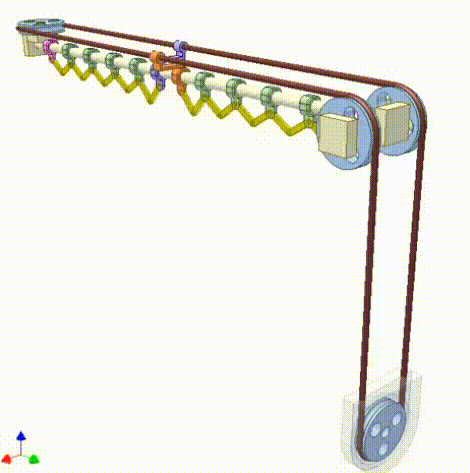

# Automatic curtain closer

This system closes the curtains when the sun goes away, to keep the solar heat in and reduce heating costs.

The system needs a detector that can sense very bright light (e.g., the sun), and can trigger curtain closing when the sun has vanished for a certain time. It should not close immediately, as it could be a wrong measurement, or the sun can come back.
If there is a internet connection, the system may take the short range weather forecast into account to make a decision to close.
For cost reasons, it is possible that the system may not be able to open the curtain again, and may need to be reset manually.
Closing works by releasing a weight with a servo arm. The potential energy of the weight moves the curtain via simple pulleys.
The locking mechanism should, for convenience, move back into the original position after releasing the weight for starting the curtain closing operation.

To start off, we split the jobs into small parts, assigned to each induvidual:

| Person | Job |
| ---- | ------|
| hermonochy | Create the hardware to open/close the curtains and log the sensor data. |
| Meron3r | Create a program to get the Weather Forecast, due to the possibility of a temporary occlusion of sun. |
| cheesecat123 | Create a program to log the temperature sensor measurements |

## The Curtain System

We originally decided on a simple but effective curtain system, as shown in the video below:

However, the resistance between the curtain and the railing was so great that it overcame the pulley connected to the motor and the required parts were out the budget of this project, so we decided on a simpler mechanism to only close the curtain. A weight would be connected to the curtain, to be released by a servo. The weight would fall and provide the energy to close the curtain. The user has to reset the curtain when the sun is about to heat the room again in the next morning. 

## The Sensor System

In order to know when to close the curtain, we needed some sensors. Our options were:

- A temperature sensor
- A UV detector
- A Photoresistor (A light sensor)
- A Photo Diode (A faster light sensor)

We eventually decided upon a Temperature and Light Sensor. The exact types were the [DS18B20](#temp-sensor) and [LDR Photo Resistor](#light-sensor) respectively. We bought 2 temperature sensors to place one directly next to the window and one in the middle of the room, to determine if the sun is still heating.

## Our Orders

### Light sensor:

- Price: £ 3.99

- quantity: 1

- Link: https://www.ebay.co.uk/itm/201382079052?chn=ps&norover=1&itemid=201382079052&targetid=4585169654799843&device=c&mktype=&googleloc=&poi=&campaignid=412354547&mkgroupid=1305120599331881&rlsatarget=pla-4585169654799843&abcId=9300541&merchantid=87779

### Temp sensor:

- Price: £ 3.95

- quantity: 2

- Link: https://www.ebay.co.uk/itm/272667082078?chn=ps&var=571797800872&norover=1&itemid=571797800872_272667082078&targetid=4585169654799843&device=c&mktype=&googleloc=&poi=&campaignid=412354547&mkgroupid=1305120599331881&rlsatarget=pla-4585169654799843&abcId=9300541&merchantid=87779

### Total: £ 11.89

